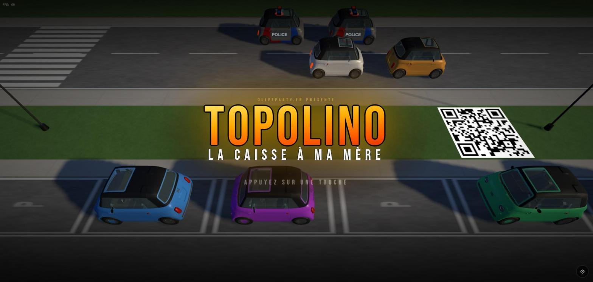
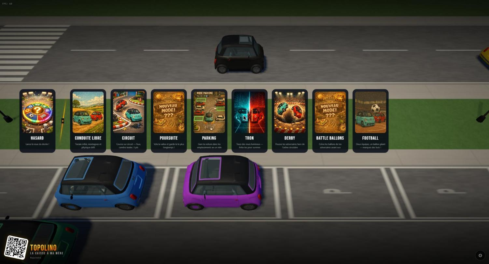
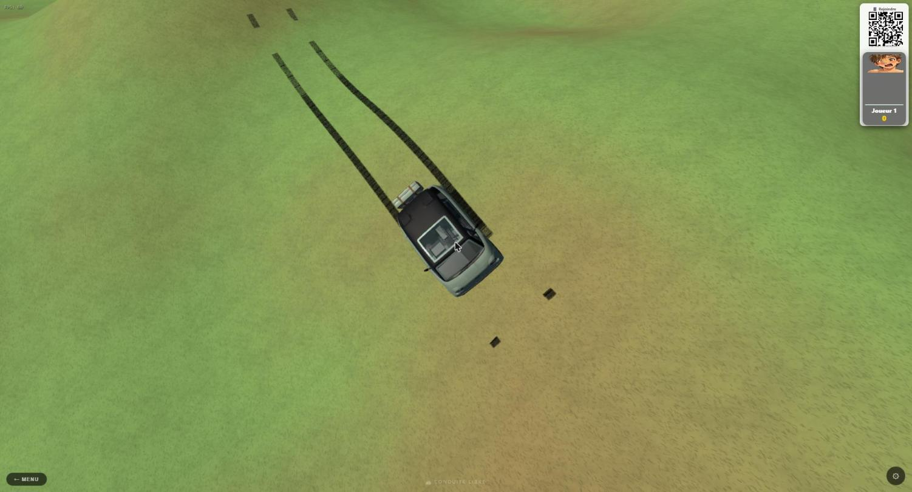
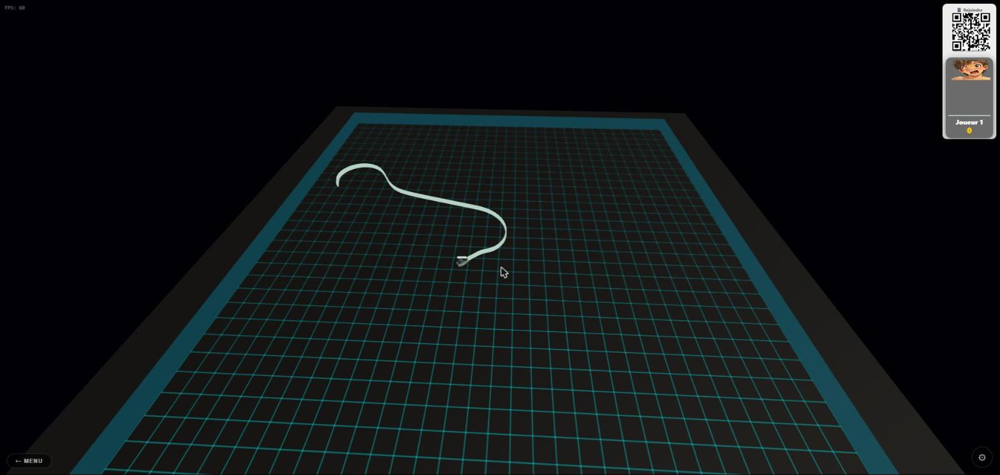

# Topolino — La Caisse à Ma Mère

Jeu de voiture 3D dans le navigateur, construit avec Three.js. Une Fiat
Topolino roule sur une route infinie avec de la physique de drift, des traces
de pneus, et une caméra orbitale. Aucun build : ES modules purs chargés via
un importmap CDN.

Le jeu embarque aussi un **mode multijoueur** : les joueurs rejoignent depuis
leur téléphone en scannant un QR code affiché à l'écran, et pilotent leur
Topolino comme manette (deux joysticks tactiles).



## 8 modes de jeu

Depuis l'écran titre, on choisit parmi 8 modes :

| Mode | Description |
|---|---|
| **Hasard** | Roue du destin — tire un mode au hasard |
| **Conduite libre** | Terrain infini, montagnes et physique de drift |
| **Circuit** | Course sur circuit — feux, caméra leader, 5 pts |
| **Poursuite** | Vole la valise et garde-la le plus longtemps |
| **Parking** | Gare la voiture dans les emplacements en un min |
| **Tron** | Trace des murs lumineux — évite-les pour survivre |
| **Derby** | Pousse tes adversaires hors de l'arène circulaire |
| **Battle Ballons** | Crève les ballons de tes adversaires avant eux |
| **Football** | Deux équipes, un ballon géant — marquez des buts ! |



## Aperçu

Conduite libre, avec traces de pneus visibles au sol :



Mode Tron, où chaque voiture laisse un mur lumineux derrière elle :



## Lancer le jeu

```bash
start_server.bat
# ou directement :
python server.py
```

Le jeu se lance sur **http://localhost:8090**. Un QR code affiché à l'écran
permet à d'autres joueurs de rejoindre depuis leur téléphone comme manette.

---

# Notes techniques

## Mode véhicule futur (vol / hover)

Quand `VEHICULE_FUTUR = true` dans `physics.js`, les roues avant utilisent
une composition quaternion correcte **qSteer × qSpin** au lieu de l'assignation
Euler simple. Cette orientation donne un effet "rotor" réaliste pour un véhicule
volant : les roues s'orientent librement dans les 3 axes sans conflit Euler/quaternion.

### Principe

```js
// Pré-alloués (module level)
const _AX = new THREE.Vector3(1, 0, 0);
const _AY = new THREE.Vector3(0, 1, 0);
const _AZ = new THREE.Vector3(0, 0, 1);
const _qSteer = new THREE.Quaternion();
const _qSpin  = new THREE.Quaternion();

// Roues arrière — spin pur
w._spin = (w._spin || 0) + spinDelta;
const ax = w._axis === 'x' ? _AX : w._axis === 'y' ? _AY : _AZ;
w.quaternion.setFromAxisAngle(ax, w._spin);

// Roues avant — braquage composé avec spin
_qSteer.setFromAxisAngle(_AY, steerAngle);   // orientation
_qSpin.setFromAxisAngle(ax, w._spin);         // rotation propre
w.quaternion.multiplyQuaternions(_qSteer, _qSpin);
```

### Pourquoi ce n'est pas l'axe correct pour la Topolino

Dans le FBX topolino_low49k.fbx, les roues ont des parents intermédiaires
avec des rotations propres (rotation exportée par le modeleur). L'axe Y local
du mesh roue n'est pas l'axe vertical du monde — donc `setFromAxisAngle(_AY, steer)`
ne produit pas un braquage visuel correct sur ce modèle spécifique.

Pour un véhicule futur créé nativement pour ce système (roues alignées monde),
cette approche est la bonne.

### Activation

Dans `src/physics.js`, passer `VEHICULE_FUTUR = true` pour basculer.
